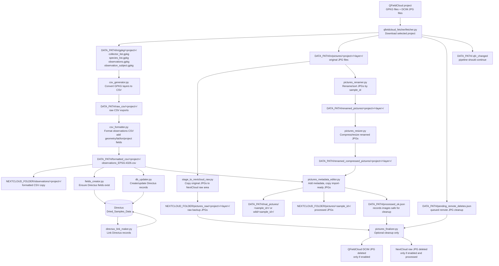

# QFieldCloud to Directus Workflow

This document traces what happens to QFieldCloud project data, where files are stored locally, and which commands run each stage.

## One-Page Flow



## Important Paths

These paths come from `.env`:

```bash
DATA_PATH=/media/data/qfieldcloud_data/data
NEXTCLOUD_FOLDER=/media/data/nextcloud_data/emi/files/output
LOGS_PATH=/media/data/qfieldcloud_data/logs
PIPELINE_PROJECT=manaslu
```

Project-specific staging paths:

```text
DATA_PATH/in/gpkg/<project>/
DATA_PATH/in/pictures/<project>/
DATA_PATH/raw_csv/<project>/
DATA_PATH/formatted_csv/<project>/
DATA_PATH/renamed_pictures/<project>/
DATA_PATH/renamed_compressed_pictures/<project>/
DATA_PATH/inat_pictures/<sample_id>/
DATA_PATH/inat_pictures/wild/<sample_id>/
```

NextCloud output paths:

```text
NEXTCLOUD_FOLDER/pictures_raw/<project>/<layer>/
NEXTCLOUD_FOLDER/observations/<project>/
NEXTCLOUD_FOLDER/pictures/<sample_id>/
```

State and control files:

```text
DATA_PATH/state.json
DATA_PATH/last_fetch_summary.json
DATA_PATH/.qfc_changed
DATA_PATH/pending_remote_deletes.json
DATA_PATH/processed_ok.json
DATA_PATH/.last_finalize
```

## What Each Stage Does

| Stage | Script | Main input | Main output | External system touched |
|---|---|---|---|---|
| Fetch QFieldCloud | `fetcher.py` | QFieldCloud project files | `in/gpkg`, `in/pictures`, manifest, marker | QFieldCloud read |
| Stage raw photos | `stage_to_nextcloud_raw.py` | `in/pictures` | `NEXTCLOUD_FOLDER/pictures_raw` | NextCloud filesystem write |
| Export CSV | `csv_generator.py` | `in/gpkg` | `raw_csv` | none |
| Format CSV | `csv_formatter.py` | `raw_csv` | `formatted_csv`, NextCloud CSV copy | NextCloud filesystem write |
| Ensure fields | `fields_creator.py` | formatted CSV columns | Directus fields | Directus schema/API |
| Push observations | `db_updater.py` | formatted observations CSV | Directus records | Directus data/API |
| Link records | `directus_link_maker.py` | Directus records | linked Directus records | Directus data/API |
| Rename photos | `pictures_renamer.py` | `in/pictures` | `renamed_pictures` | none |
| Resize photos | `pictures_resizer.py` | `renamed_pictures` | `renamed_compressed_pictures` | none |
| Add metadata | `pictures_metadata_editor.py` | compressed JPGs + formatted CSV | `inat_pictures`, NextCloud processed photos, `processed_ok.json` | NextCloud filesystem write |
| Optional cleanup | `pictures_finalizer.py` | manifest + `processed_ok.json` | remote JPG deletion, raw JPG deletion | QFieldCloud delete, NextCloud raw delete |

## Normal Commands

Run the full pipeline:

```bash
./qfieldcloud_fetcher/launcher.sh
```

Fetch one project only:

```bash
poetry run python3 qfieldcloud_fetcher/fetcher.py --project manaslu
```

Run the full downstream path for one project after fetching:

```bash
poetry run python3 qfieldcloud_fetcher/stage_to_nextcloud_raw.py --project manaslu
poetry run python3 qfieldcloud_fetcher/csv_generator.py --project manaslu
poetry run python3 qfieldcloud_fetcher/csv_formatter.py --project manaslu
poetry run python3 qfieldcloud_fetcher/fields_creator.py --project manaslu
poetry run python3 qfieldcloud_fetcher/db_updater.py --project manaslu
poetry run python3 qfieldcloud_fetcher/directus_link_maker.py --project manaslu
poetry run python3 qfieldcloud_fetcher/pictures_renamer.py --project manaslu
poetry run python3 qfieldcloud_fetcher/pictures_resizer.py --project manaslu
poetry run python3 qfieldcloud_fetcher/pictures_metadata_editor.py --project manaslu
poetry run python3 qfieldcloud_fetcher/pictures_finalizer.py --project manaslu
```

Delete only remote QFieldCloud JPGs that were already processed:

```bash
poetry run python3 qfieldcloud_fetcher/pictures_finalizer.py --project manaslu --enable-remote-delete
```

Force remote deletion for queued JPGs, even if local processed/raw checks are not satisfied:

```bash
poetry run python3 qfieldcloud_fetcher/pictures_finalizer.py --project manaslu --force-remote-delete
```

Use force mode carefully. Normal mode is safer because it only deletes remote JPGs when the pipeline recorded them as processed.

## Manaslu Example

For the Manaslu run on 2026-06-29:

```text
Fetcher downloaded: 4 GPKG + 40 JPG
CSV observations prepared: 6 rows
Directus records created: 6
Pictures processed: 40 attempted
Pictures copied to iNaturalist staging: 30
Pictures without matching CSV row: 10
```

The processed Manaslu photos are in:

```text
DATA_PATH/inat_pictures/dbgi_003132/
DATA_PATH/inat_pictures/wild/dbgi_003165/
DATA_PATH/inat_pictures/wild/dbgi_003174/
DATA_PATH/inat_pictures/wild/dbgi_003175/
DATA_PATH/inat_pictures/dbgi_003213/
DATA_PATH/inat_pictures/dbgi_003215/
```

The 10 photos without matching observation CSV rows remain in:

```text
DATA_PATH/renamed_compressed_pictures/manaslu/manaslu/
```

Those unmatched photos corresponded to:

```text
dbgi_003177_*.jpg
dbgi_003178_*.jpg
```

They were not copied to `inat_pictures` because `pictures_metadata_editor.py` could not find matching rows for `sample_id=dbgi_003177` and `sample_id=dbgi_003178` in the formatted observations CSV.

## Cleanup Semantics

Remote cleanup is not automatic unless enabled.

Without delete enabled:

```bash
poetry run python3 qfieldcloud_fetcher/pictures_finalizer.py --project manaslu
```

This only reports pending manifest entries and does not delete remote or raw files.

With delete enabled:

```bash
poetry run python3 qfieldcloud_fetcher/pictures_finalizer.py --project manaslu --enable-remote-delete
```

This deletes queued QFieldCloud `DCIM/...jpg` files only when:

```text
1. the entry is in DATA_PATH/pending_remote_deletes.json
2. the picture is marked processed in DATA_PATH/processed_ok.json
3. the matching raw copy exists in NEXTCLOUD_FOLDER/pictures_raw/
```

When remote deletion succeeds, the finalizer also removes the matching raw JPG from:

```text
NEXTCLOUD_FOLDER/pictures_raw/<project>/<layer>/<filename>.jpg
```

Processed import-ready photos remain in:

```text
DATA_PATH/inat_pictures/
NEXTCLOUD_FOLDER/pictures/
```

## Quick Inspection Commands

Count local Manaslu GPKGs:

```bash
find /media/data/qfieldcloud_data/data/in/gpkg/manaslu -maxdepth 1 -type f -name '*.gpkg' -printf '%f\n' | sort
```

List local Manaslu compressed photos:

```bash
find /media/data/qfieldcloud_data/data/renamed_compressed_pictures/manaslu -type f -iname '*.jpg' -printf '%p\n' | sort
```

List Manaslu iNaturalist staging photos:

```bash
find /media/data/qfieldcloud_data/data/inat_pictures -type f -iname 'dbgi_003*.jpg' -printf '%p\n' | sort
```

Check pending remote deletes for Manaslu:

```bash
jq '[.[] | select(.project_name == "manaslu")] | length' /media/data/qfieldcloud_data/data/pending_remote_deletes.json
```

Check the latest fetch summary:

```bash
jq . /media/data/qfieldcloud_data/data/last_fetch_summary.json
```

Check the latest pipeline log:

```bash
less /media/data/qfieldcloud_data/logs/pipeline_latest.log
```

